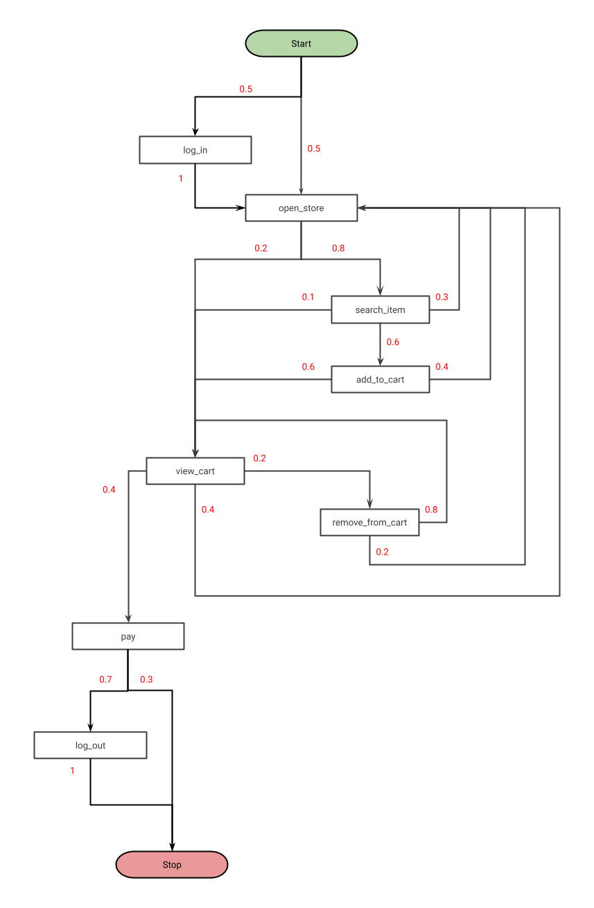

# AWS capstone project

## Data generation

Data for this project should look like data from the online store.

The dataset should contain user ids, items, and user actions.

I generate prices and discounts for the items using [Pareto distribution](https://en.wikipedia.org/wiki/Pareto_distribution). In this way, they look more natural: the number of cheap items in the store is much larger than the number of expensive items.

For the sake of simplicity, the number of user actions types is much smaller than in the real online store.

Here is a diagram of the flow of user actions:

- To generate data for this flow of user actions I use the idea from the [Markov chain](https://en.wikipedia.org/wiki/Markov_chain).
- Here, red numbers indicate the probability of the user switching to a specific user action.